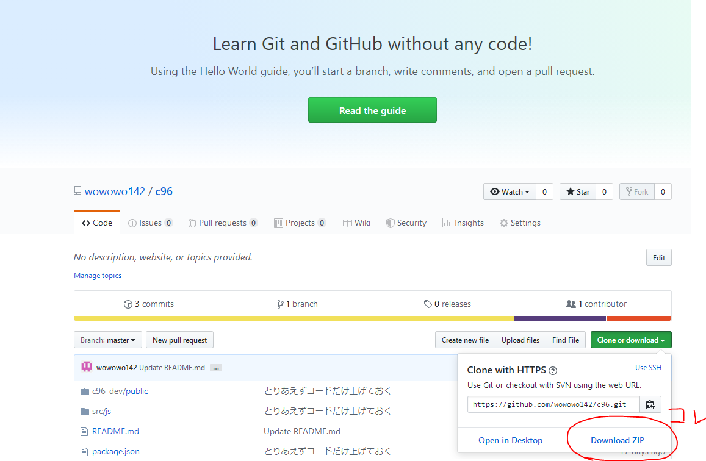
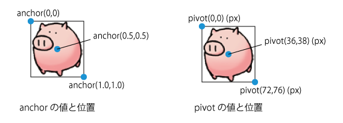
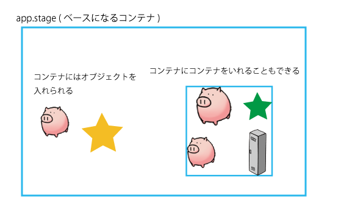

<span style="font-size:0.85rem">この解説のテキストは誰でも自由に複製・転載してくださって構いませんが、筆者は内容の正確性を100%保証せず、利用によって生じた問題・不利益について筆者は責任を負いません.</span>  


# ~~PixiJSでルーム風機能(クォータービューマップ)を作ろうのコーナー~~
# 初心者による初心者のためのPixiJS入門  
書いた日: 2019/08/31


## 何これ？誰お前？

地井 a.k.a. たけを(ex.wowowo142)です。 [(誰？)](https://twitter.com/chiisanwo)  
C96でめごちもさんが発行した合同誌の[告知ページ](http://amaai-poconuts.com/c96/)をPixiJSを使って作りました。  

このページでは↓のことを解説していきます 

* <a href="#1">PixiJS(v5)の基礎</a>
* ルーム風機能の概要・実装のポイント
* (おまけ)SpineアニメーションをPixiで動かす

想定読者は、JavaScriptやFlash(ActionScript)の知識が少しあってぐりぐり動かせるWebサイトを作ったりしてみたい人(~PixiJSの基礎)、なんとなくJavaScript(ES6)が書けて告知サイトの実装が気になる人(ルーム機能~)です。 

## なんで書いた？

Flashがもうすぐ(来年末)死んじゃうらしいので。(なんだかんだ生き延びる気もしますが...)  

Flashからの乗り換え先としてわりとよさげ(Flash未経験なので信憑性無)なPixiですが、登場からの年月、知名度のわりに初心者向けの日本語記事があまりありません。人気ないんでしょうか。また、Pixiはバージョンアップでお作法がけっこう変わる部分があり、数年前の記事に載っているコードではうまく動作しないことがしばしばあります(この解説もそのうち使えなくなりそう)。  

そのため、現在(2019年8月)Flashからの乗り換えを検討している人や、これからWebアニメーションを始めたい初心者の助けになればと思って書きました。(当初はルーム風機能の実装解説メインのつもりでしたが需要なさそうなので変えました)  

自分は今回初めてちゃんとWebアニメーションに触れ、それまでFlash等の経験も皆無だったため、セオリーから外れる部分や何年前の話してんの？という部分があるかもしれませんが、多めに見ていただきつつ、よければご指摘いただければありがたいです。    

<br>

## <span id="1">1. PixiJS(v5)の基礎</span>

#### <a href="#1-1">1.1 PixiJS is 何</a>
#### <a href="#1-2">1.2 開発環境を作る</a>
#### <a href="#1-3">1.3 Pixiアプリケーションを生成する</a>
#### <a href="#1-4">1.4 スプライトや図形を表示する</a>
#### <a href="#1-5">1.5 コンテナを作ってオブジェクトをまとめる</a>
#### <a href="#1-6">1.6 オブジェクトがクリックされたときになんかする</a>
#### <a href="#1-7">1.7 オブジェクトをドラッグして動かす</a>
#### <a href="#1-8">1.8 毎フレーム何らかの処理を実行する</a>
#### <a href="#1-9">1.9 キーボードが押されたときにオブジェクトを動かす</a>
#### <a href="#1-10">~~1.10 パラパラ(フレーム)アニメーションするスプライトを作る~~~</a>
#### <a href="#1-11">1.11 Tickerを使わずにアニメーションする(別ライブラリを併用)</a>
#### <a href="#1-12">1.12 テキストを表示する</a>
#### <a href="#1-13">1.13 オブジェクト同士の当たり判定</a>
#### <a href="#1-14">1.14 オブジェクトの当たり判定領域をカスタマイズする</a>


<br>
 
### <span id="1-1">1.1 PixiJS is 何</span>  
**初心者向けの説明**  
[PixiJS](https://www.pixijs.com/)(以下Pixi)はブラウザ上で、様々な2Dグラフィックス処理を実現するためのJavaScriptライブラリです。商用でも無償で使用できます(MITライセンス)。  
アイマスPに身近なものでは、アイドルマスターシャイニーカラーズ(以下シャニマス)のゲームエンジンenza-game.jsのグラフィックス部分にPixiが採用されています(2019/8現在)。<span style="font-size:0.85rem">[※参考記事](https://www.gamer.ne.jp/news/201808240094/)</span>  
<span style="font-size:0.9rem">ちなみに、シャニマスのキャラモーションには[Spine](http://ja.esotericsoftware.com/)が採用されています。PixiでSpineを利用する方法についても、このコーナーのおまけ部分で解説します。</span>

**Pixiでできること**
* 描画オブジェクト(以下オブジェクト。スプライトや図形)の描画
* オブジェクトのアニメーション(移動・回転・パラパラアニメーション)
* フィルター処理
* オブジェクトとのインタラクション(クリックやドラッグといったユーザー操作の検知)

**Pixiのメリット**
* 処理の記述が(ライブラリを使用しない場合に比べて)簡単
* スマホでも動く
* 内部ですごい最適化をしているので軽い<span style="font-size:0.85rem">(実際はWebGLのメリット)</span>
* 演算処理にGPU(≒グラボ)を利用できるため、ハードの性能を活かせる(≒軽い)

**Pixiのデメリット**
* 日本語ドキュメントが少ない(なんなら英語も多くない)
* 未だ不完全な部分もある(更新頻度は高い/反面仕様が変わる場合がある)

Pixiはゲームエンジンではないので、ゲーム制作のためには機能不足な面があります(ex:物理演算)。Pixiをグラフィックス部分に使用した2Dゲームエンジンとして、[Phaser](https://phaser.io/)があるので、手っ取り早くスマホ対応ブラウザゲームを作りたい方は見てみるといいかもしれません。<span style="font-size:0.85rem">※筆者は使ったことないです。詳しいことはググってください。</span>

また、Pixiは3Dグラフィックスのためのライブラリではありません([できないとは言ってない](https://lumina.goodboydigital.com/))。3Dがやりたい人は、[three.js(入門サイトリンク)](https://ics.media/tutorial-three/)を試してみてください。
&nbsp;

**ちょっと知ってる人向けの補足(よく分からんかったら読み飛ばしても大丈夫)**  
PixiはWebGLのラッパーです。飛んでそうな疑問にここでいくつか回答しておきます。

Q. WebGLって3D描画のためのものじゃないの？
A. おっしゃる通りWebGL(とその土台のOpenGL等)は一般的に3Dグラフィックスの高速処理を目的に利用されるAPI規格ですが、2Dグラフィックスに使えないということはありません(当たり前っちゃ当たり前ですが...)。

Q. パーティクルがぶわーとかフィルタがぐわーみたいな重い描画に使うならわかるけど、その告知ページ程度の描画にWebGLいる？  
A. たしかに。比較してないので分かりませんが、WebGL非対応の既存2Dライブラリで実装しても大して処理速度は変わらんのではないかと思います。ただ、素のWebGLだったらわざわざ使うにはハードルが高すぎるのでやりませんが、Pixiはざっと見他の人気ライブラリと同じくらい利用が容易ですし本体も350KB程度とそれほど重くなく、難易度が同じで(潜在的な)処理性能が高いならそっち使うよねという話です。<span style="font-size:0.85rem">あと単にPixiやってみたかった。</span>

Q. スマホでどこまでできる？
A. 数年前の端末だとシャニマスくらいがギリギリなんだと思います(内部でさらに最適化する前提)。告知ページ程度のオブジェクト数なら割とまともに動きます(端末熱くなるけど。実装が悪い説)。

Q. 端末(ブラウザ,OS)がWebGL未対応なんですが  
A. v5より前のバージョンか、`pixi-legacy.js`を使うとCanvas2Dへのフォールバックが有効になるっぽいです。[参考](https://medium.com/goodboy-digital/pixijs-v5-lands-5e112d84e510)("First-Class WebGL"のあたり)

Q. WebGPUがメジャーになったら死ぬ  
A. Pixiが対応してくれるでしょうきっと...。どんな規格やライブラリもいつか死ぬ(でもとりあえず数年は大丈夫そう)。

Q. Flashでいいです  
A. なんだかんだ生き残りそうだよね。iOSとかいうスカした奴は無視。

Q. 他のHTML5(Canvas 2D, WebGL)ライブラリでいいです  
A. いいのあったら教えてほしいです。

Q. UnityのWebGL(+WebAssembly)ビルドでいいです  
A. 本体が重くない？ロード画面って消せるんでしたっけ。ゲームなら全然いいと思います(低能なのでTinyUnityには手出せてません)。  

<br>

### <span id="1-2">1.2 開発環境を作る</span>
前置きが長いと怒られそうですが、まだ前置きです。  
実際にサンプルを見ていく前に、サンプルを動かす環境を作りましょう(分かる人はこの項全て読み飛ばして大丈夫です)。  

Pixiを使ったプログラムを動かすには、サーバーが必要となります。  
サーバーなんて持ってない...立てられない...という人でも大丈夫です。最近のエディタは拡張機能で簡易サーバーを立てることができるので、それを使いましょう。ちょっと面倒な作業ですが、がんばってください。  

※この解説ではVisual Studio Code(通称VSCode)というエディタを使用します。VSCode以外のエディタのセットアップ方法は解説しません。悪しからず。

1. VSCodeをインストールする  
公式サイトのダウンロード https://code.visualstudio.com/Download から、自分のOSに合ったインストーラーをダウンロードし、実行します。インストーラーにしたがってインストールしてください。  

2. 言語設定を変更する  
VSCodeを起動し、下の画像の赤丸のボタンをクリックして拡張機能の追加画面を開きます。<br><br>
  
<br>
検索窓が表示されるので、"Japanese Language Pack for Visual Studio Code
"と入力し、一番上に出てくるものの"install"をクリックします。これはMicrosoftが配布しているVSCodeの日本語化パッケージです。インストールが完了したら、一度VSCodeを再起動してください。  <br><br>
再起動したら、下の画像のように、[View]→[Command Palette]を選択します。  <br><br>
 
<br><br>
入力窓が表示されるので、`>Configure Display Language`と入力しエンターキーを押します。  
使用可能な言語の一覧が表示されるので、'ja'をクリックします。すると、再起動を促すダイアログが表示されるので、"restart"をクリックして再起動します。これでメニュー類が日本語されるはずです。   

3. 必要な拡張機能をインストールする  
インストールする拡張機能は下記のとおりです。
  * Live Server  
    VSCode内で起動できる簡易Webサーバー  
  * Easy Sass   
    SCSS(CSSの見やすい記法)ファイルを、保存時に自動的にCSSに変換してくれるやつ
どちらも日本語化パックをインストールしたときと同様に、拡張機能ボタンを押し、検索窓にそれぞれの名前を入力して一番上に出てきたものをインストールしてください。  <br>

最後に、この解説ページのトップから、サンプル一式をダウンロードしましょう。



画像の中段右にある緑色の"Clone or download"ボタンをクリックし、開いたメニューから"Download ZIP"をクリックして任意の場所に保存、zipを解凍します。  

解凍できたら、VSCodeを起動し、[ファイル] → [フォルダーを開く] で解凍したフォルダを開きます。

フォルダが開けたら、先ほどインストールしたLive Serverを起動しましょう。

 

画像の右下にある"Go Live"ボタンをクリックします。サーバーが起動すると、デフォルトのブラウザが起動し、このフォルダのトップページ(たいていは http://127.0.0.1:5500)が開くはずです。ボタンがない場合は、拡張機能インストールの手順を再確認してください。

 

おそらく、ブラウザには↑の画像のような画面が表示されていると思います。サンプルプログラムはこの中の"sample"フォルダで動かしますので、"sample"をクリックしてページを移動してください。

以上でサンプルの動作環境構築は完了です。


### <span id="1-3">1.3 Pixiアプリケーションを生成する</span>
準備ができたので、実際にサンプルを動かしていきましょう。  
この項ではオブジェクトを描画するための大枠部分を準備する手順を説明します。さっさと画像を表示したいしたいんですけど？という人は<a href="#1-4">飛ばして1.4に進んでも大丈夫です。</a>


まず、ブラウザで"sample"フォルダを開くと、水色の正方形が表示されているはずです。これは描画のための大枠部分を生成してHTMLに突っ込んだだけの状態です(分かりやすくするために背景色を設定しています)。
サンプルのHTML(`/sample/index.html`)はこんな感じ。  

```html
<!DOCTYPE html>
<html>
    <head>
        <meta charset="utf-8" />
        <meta http-equiv="X-UA-Compatible" content="IE=edge">
        
        <title>pixi.jsお試し用</title>

        <link rel="stylesheet" type="text/css" media="screen" href="./css/sample.css" />

        <!-- pixi.jsの本体の読み込み -->
        <script type="text/javascript" src="https://cdnjs.cloudflare.com/ajax/libs/pixi.js/5.0.1/pixi.min.js"></script>

        <!-- アニメーション用のライブラリ(GSAP/TweenMax)の読み込み -->
        <script type="text/javascript" src="https://cdnjs.cloudflare.com/ajax/libs/gsap/2.0.1/TweenMax.min.js"></script>
        <script type="text/javascript" src="https://cdnjs.cloudflare.com/ajax/libs/gsap/2.0.1/plugins/PixiPlugin.min.js"></script>
    </head>
    <body>
        <main id="app">
            <!-- ここにPixiのビュー(Canvas)が入る -->
        </main>
    </body>
    <script type="text/javascript" src="./js/sample.js"></script>
</html>
```

いたってシンプルです。  

次に、JavaScriptでPixiアプリケーション(`PIXI.Application`オブジェクト、以下app)を生成し `<main id="app"> </main>` の中にappのビュー(描画領域)を突っ込む処理を見ていきたいところですが、その前に、`PIXI.Application`って何者？というところを解説します。  

`PIXI.Application`は、いくつかの基本的な機能が1まとめになった、Pixiを使った処理の土台です。とにもかくにも`PIXI.Application`を生成するところから始まります。
下の表に`PIXI.Application`が持っている機能(メンバ)をまとめます。ざっと流し読みする程度で大丈夫です。それぞれの関係については、こちら [簡単アニメーション！Pixi.jsを触ってみる！（1）テキストを動かしてみる - Qiita](https://qiita.com/tadfmac/items/3684489e133320cd9d75) の記事の真ん中あたりにある図が分かりやすかったので、イメージを掴むために見てみるといいかもしれません。これらは古いバージョンではそれぞれバラバラに生成されていたようですが、たいていの処理で使うものとしてまとめられたようです。

|名前|概要|クラス(型)|  
|:--:|:--:|:--:|  
|view|ビュー。HTMLに挿入される\<canvas\>要素|HTMLCanvasElement|  
|stage|ステージ。画面に表示するオブジェクトたちの入れ物|PIXI.Container|
|screen|スクリーン。viewの大きさなどの情報を持っている|PIXI.Rectangle|
|以下は今は<br>無視してよい|||
|renderer|レンダラー。名前の通りレンダリングを担う|PIXI.Renderer or PIXI.CanvasRenderer|
|loader|ローダー。画像ファイルなどの読み込みを担う|PIXI.Loader|

このほかにも`PIXI.Application`が持つ機能はありますが、分かりにくくなるので割愛します。詳細が気になる人は公式リファレンスをどうぞ [PixiJS API Documentation - PIXI.Application](https://pixijs.download/dev/docs/PIXI.Application.html)。  

それでは、appを生成する処理を見ていきましょう。 `/sample/sample.js` の\/\*1.3\*\/とコメントがついている部分が該当処理です。  

```js
/**
 * 1.3 
 */
// Pixiアプリケーション生成
let app = new PIXI.Application({
    width: 600,     // スクリーン(ビュー)横幅 
    height: 600,    // スクリーン(ビュー)縦幅  
    backgroundColor: 0x1099bb,  // 背景色 16進 0xRRGGBB
});
// HTMLの<main id="app"></main>の中に上で作ったPIXIアプリケーション(app)のビュー(canvas)を突っ込む
let el = document.getElementById('app');
el.appendChild(app.view);
```

やってることは全てコメントに書いてある通りです。  
一応少し補足すると、HTMLに突っ込まれるcanvasは、 `new PIXI.Application()` のwidth,heightで指定したピクセルサイズになります。 

また、backgroundColorに指定している`0x~~`というのはJavaScriptでの16進数の記法です。`0x000000`とか設定すると背景が真っ黒になるのでやってみてください。  

横幅100%で表示したいんですけど...という人も多いかと思います。実は100%表示は初心者には結構面倒くさい部分で、resize()がどうこうとかしなきゃいけません。なのでここでは正攻法ではない方法を紹介します。app生成時のwidth,heightの設定値が意味なくなるとか色々問題あるので、リサイズ関連の理解が進んだらちゃんとした実装に切り替えてください。<span style="font-size:0.85rem">(実は告知ページはこれで対応している...)</span>  

この方法ではCSSを使います。`/sample/sample.scss` を開いて、コメント部分を解除し、上書き保存してください。これで常に(ウィンドウサイズを変えても)横幅100%で表示されるようになったはずです。(scssは、cssの親子関係を入れ子で表現できるようになった形式だと思ってください)  
なお。index.htmlでは`sample.css`を読み込んでいます。これは拡張機能としてインストールしたEasy Sassの機能で、sample.scssを保存する際に自動的に生成されます。

```scss
#app {
    canvas {
        width: 100% !important;
        height: auto !important;
    }
}
```


### <span id="1-4">1.4 スプライトや図形を表示する</span>
ここからようやくオブジェクトを描画していきます。
`/sample/sample.js` の\/\*1.4\*\/ の下から /\*1.5\*\/の手前までの箇所をすべて選択した状態で、`Ctrl + /` を押してください(※ `Ctrl + /` は選択した範囲のコメントのオン/オフを切り替えるショートカットです)。コメントが解除できたら、上書き保存して、ブラウザの表示を確認してください。  

こんな感じになってるかと思います。1つ1つのオブジェクトの描画処理について補足していきます。  
なお、PixiJSでは画面の左上が原点で、右下に行くほどx,yは大きくなります。

#### 真ん中のぶた(スプライト(PIXI.Sprite))

``` JS
// 画像を読み込み、テクスチャにする
let butaTexture = new PIXI.Texture.from('./img/buta.png');
// 読み込んだテクスチャから、スプライトを生成する
let butaSprite = new PIXI.Sprite(butaTexture);
// ぶたの基準点を設定(%) 0.5はそれぞれの中心 位置・回転の基準になる
butaSprite.anchor.x = 0.5;
butaSprite.anchor.y = 0.5;
// ぶたの位置決め
butaSprite.x = app.screen.width / 2;        // ビューの幅 / 2 = x中央
butaSprite.y = app.screen.height / 2;       // ビューの高さ / 2 = y中央
// 表示領域に追加する
app.stage.addChild(butaSprite);
```  

## \*\*オブジェクトはステージ(`app.stage`)に追加(`app.stage.addChild()`)しないと表示されないので注意してください。\*\*

スプライトの生成は、テクスチャの生成を省略して、`let butaSprite = new PIXI.Sprite.from('./img/buta.png');` とすることもできます。今回は同じテクスチャを後の処理でも使用するため`butaTexture`を作っていますが、1度しか使わない場合は`new PIXI.Sprite.from()`の方が簡潔です。  

基準点(`anchor`,`pivot`)の値とスプライト上の位置関係のイメージを、下の画像で補足します。

  

`anchor`は、スプライト、テキスト、テクスチャに存在する概念です。他のオブジェクトでは、`pivot`を使用して基準点を決めます(スプライトやテキストでも`pivot`は使える)。どちらもオブジェクトの大きさ以上の値や、マイナス値を設定することもできます。  
`anchor`のおかげで、スプライトなどの実際のピクセルサイズが分からなくても、パーセンテージで基準点を設定することができます。


#### 黄色いでかいぶた(スプライト)

``` JS
// 別のぶたを作る
let butaSprite2 = new PIXI.Sprite(butaTexture); // テクスチャは同じものを使いまわせる
// 基準点を設定 set()を使うとx,y同時に設定できる
butaSprite2.anchor.set(0.5);
// 大きさを変えてみる
butaSprite2.scale.x = 1.5;
butaSprite2.scale.y = 1.5;
// 回転してみる
butaSprite2.rotation = Math.PI / 3;          // (ラジアンで指定)
// butaSprite2.angle = 60;                        // (度数で指定)
// 色味を変えてみる
butaSprite2.tint = 0xffff00;                // (基準は0xffffff)

butaSprite2.x = app.screen.width / 2 + 150;
butaSprite2.y = app.screen.height / 2;
app.stage.addChild(butaSprite2);

```

`anchor`の値を設定する際、x,yが同じ値の場合は`anchor.set()`を使うと便利です。`pivot`には`set()`はないので注意してください。

`scale.x`・`scale.y`の値を変えることで、縦横に拡大・縮小することができます。基準値は1.0です。スケーリングの際の補間方法は、線形補間法です。(最近傍法に変更できるってリファレンスに書いてあったんですが、できませんでした)

回転パラメータ`rotation`にラジアンを代入することでオブジェクトを回転させることができます。度数で指定したい場合は、`angle`が使用できます。  

`tint`を使うと色合いを調整することができます。


#### 赤い楕円(図形(PIXI.Graphics))

``` JS
// 楕円を作る
let ellipse = new PIXI.Graphics()       // メソッドチェーンで描画するので、;(セミコロン)を付けない   
.beginFill(0xff0000)                    // endFill()までの描画に対する塗りつぶし色指定
.drawEllipse(0,0,30,20)                 // (中心のx座標, 中心のy座標, 幅, 高さ)
.endFill();                             // ここまでに描いた図形を塗りつぶす

// 基準点を設定(px) 図形(PIXI.Graphicsにはpivotはないので注意)
ellipse.pivot.x = 15
ellipse.pivot.y = 10
ellipse.x = 100;
ellipse.y = 100;     
ellipse.rotation = Math.PI / 6;
app.stage.addChild(ellipse);

```

Pixiでは画像を読み込む以外にも基本的な図形や線を描画してスプライトと同様のオブジェクトとして扱うことができます。  

図形生成は、`new PIXI.Graphics().塗りつぶしの指定().図形の描画1().図形の描画2.,...,.図形の描画n().塗りつぶしの終了()`というメソッドチェーンで実行します。  
なんのこっちゃわからん人はノリでサンプルを使いまわしてください。  
draw~~で描ける図形については[こちらを参照して下さい](https://pixijs.download/dev/docs/PIXI.Graphics.html#drawCircle)。


#### 白い六角形(図形)

``` JS
// 多角形を作る
let polygon = new PIXI.Graphics()
.beginFill(0x00dd00, 0.8)    // 第二引数で透明度を指定できる
.drawPolygon([  // 頂点を配列で渡す [x1,y1,x2,y2,....]
                0, 0,
                25, -20,
                50, 0,
                50, 20,
                25, 40,
                0, 20
            ])
.endFill();
polygon.x = 100;
polygon.y = 100;
app.stage.addChild(polygon)
```

`beginFill()`では透明度を設定することができます。若干透明にしているので、六角形の下の楕円が透けて見えるのが分かると思います。  

`drawPolygon()`は、配列で渡した頂点群を結んだ多角形を描画します。渡せる値にはいくつか種類があります。詳しく知りたい方は[公式リファレンス](https://pixijs.download/dev/docs/PIXI.Graphics.html#drawPolygon)を見てください。


#### ぶたがはまってる円(図形)

``` JS
// 円を作る(テクスチャを貼る)
let circle = new PIXI.Graphics()
// 塗りつぶしのかわりにテクスチャを貼る (テクスチャ,色味(リファレンスには背景色って書いてあるからバグかも),透明度,テクスチャのスケール・位置情報)
.beginTextureFill(butaTexture, 0x00ffff, 1, new PIXI.Matrix(1,0,0,1,-35,-35))  
.lineStyle(2, 0x000000)     // 線のスタイル指定(幅, 色) これ以外に透明度, alignment(線の位置)などが指定可能
.drawCircle(0,0,30)   
.endFill();
circle.x = 200;
circle.y = 100;
app.stage.addChild(circle);
```

図形を描画する際には、`beginFill()`で色で塗りつぶすだけでなく、`beginTextureFill()`でテクスチャを貼ることもできます。


#### 黒い矢印(図形)

``` JS
// 線を描く
let line = new PIXI.Graphics()
.lineStyle(1, 0x000000)   // 線のスタイル指定(幅, 色) これ以外に透明度, alignment(線の位置)などが指定可能
.moveTo(0,0)              // 開始点に移動
.lineTo(50,0)             // (x,y)に向かって直線を引く
.lineTo(25,-25)
.moveTo(50,0)             // 現在地を移動        
.lineTo(25,25);          
line.x = 300;
line.y = 100;
app.stage.addChild(line)
```

線も描けます(多分あんまり使いません)。線の描画は`draw~~()`とは少し勝手が異なります。`moveTo()`で指定した点から、`lineTo()`で指定した点に線を引きます。線の終点からさらに線を引く場合は、`moveTo()`を実行する必要はありません。  
`lineTo()`以外に、円弧を引く`arcTo()`もあります。  
描き始め、描き終わりを、`beginFill()`, `endFill()`で囲むことで、閉じた部分を塗りつぶすこともできます。  


### <span id="1-5">1.5 コンテナを作ってオブジェクトをまとめる</span>   
コンテナ(`PIXI.Container`)という入れ物を作ってオブジェクトをひとまとめにして移動、回転することができます。  
実は`app.stage`もコンテナです。コンテナの中にさらに複数のコンテナを入れることもでき、画像編集ソフトでいうレイヤーのように使用することができます。  

 

前項と同様に、`/sample/sample.js` の\/\*1.5\*\/ の処理のコメントを外して上書き保存してください。  

``` JS
// 新しいコンテナを生成
let sampleContainer = new PIXI.Container();

// ステージのあたりに作ったコンテナを配置する
sampleContainer.x = 100;
sampleContainer.y = app.screen.height - 200;
app.stage.addChild(sampleContainer);

// 新しいコンテナにオブジェクトを入れていく
// 背景色用の長方形
let background = new PIXI.Graphics()
.beginFill(0xffff00)
.drawRect(0,0,400,200)
.endFill();

// コンテナに入れる
sampleContainer.addChild(background);

// 大量のロッカーをぶち込む
let lockerTexture = new PIXI.Texture.from('./img/locker.png')
let lockers = new Array()
for (let i=0; i < 2; i++) {
    for(let j=0; j < 13; j++ ) {
        let locker = new PIXI.Sprite(lockerTexture);
        locker.scale.x = locker.scale.y = 0.25;
        locker.x = j * 30 + 10;
        locker.y = i * 100 + 20;
        sampleContainer.addChild(locker);
        lockers.push(locker)
    }
}

// コンテナを適当に動かしたり回転させたりしてみる
// sampleContainer.x += 50;
// sampleContainer.y -= 50;
// sampleContainer.rotation = -Math.PI / 3;
// sampleContainer.scale.x = sampleContainer.scale.y = 1.5;
```

コンテナが表示されたでしょうか。最後のコメント部分も解除して、値を適当にいじってみてください。コンテナの移動・回転と一緒に中身のロッカーが動くのが分かると思います。  

コンテナにオブジェクトを入れるには、ステージに入れるのと同様、`addChild()`を使います。  
コンテナに追加するオブジェクトのx,yの基準点は、コンテナの左上端の点です。これはコンテナの`pivot`を変更しても変わりません。  
また、コンテナの大きさは中に入れるオブジェクトの大きさや位置によって変化します。事前に大きさを決めることはできません。(※ちょっとここの記述は自身がないです。まちがっていたらご指摘いただけたら嬉しいです。)<span style="font-size:0.85rem">どうしても固定サイズにしたい、という場合は[こんな方法](https://github.com/pixijs/pixi.js/issues/2051)もあるみたいです。無理やり感ない...？昔のコードなので動くかあやしいです。動作確認してません。</span>


### <span id="1-6">1.6 オブジェクトがクリックされたときになんかする</span>  
みんな大好きインタラクションです。\/\*1.6\*\/ の処理のコメントを外して上書き保存してください。  
中央のぶたをクリックするとダイアログが表示されるようになったと思います。

``` JS
// 中央のぶたのインタラクション(イベント)を有効化
butaSprite.interactive = true;

// 中央のぶたスプライトにクリックイベントのリスナーを設定する
// オブジェクト.on('イベントの種類', イベントハンドラ) で設定する
butaSprite.on('pointertap',showAlert);

function showAlert(e) {
    console.log(e);
    alert('ぶたがクリック(タップ)されました');
}

// リスナーを解除する(on()の逆)
// butaSprite.off('pointertap',showAlert);
```

オブジェクトの`on()`メソッドを使ってイベントリスナーを設定することができます。素のJavaScriptで言うところの`addEventListner()`ですが、ハンドラに飛んでくるイベントは[PIXI.interaction.InteractionEvent](https://pixijs.download/dev/docs/PIXI.interaction.InteractionEvent.html)という独自の拡張型です。次のこの解説ではあまり詳細には触れません。  

イベントリスナーを解除する際は、`off()`メソッドを使用します。  

Pixiのインタラクションに使用できるイベントの一覧は[こちら](https://pixijs.download/dev/docs/PIXI.DisplayObject.html#event:added)
です。  
`pointer~~`系のイベントは、PCのマウス操作、スマホのタッチ操作の両方で発火するので便利です。


### <span id="1-7">1.7 オブジェクトをドラッグして動かす</span>  
すこし発展的なイベント処理です。\/\*1.7\*\/ の処理のコメントを外して上書き保存してください。  
でかいぶたをドラッグアンドドロップできるようになったと思います。

``` JS
// でかいぶたのインタラクション(イベント)を有効化
butaSprite2.interactive = true;

// でかいぶたスプライトにイベントリスナーを設定する
// .on()をつなげて連続で設定することができる
butaSprite2.on('pointerdown',  onButaPointerDown)    // ぶたの上でマウスがクリック(orタップ)されたとき
           .on('pointerup',   onButaPointerUp);      // ぶたの上でマウスクリックが外れたとき


           
// ぶたの上でマウスがクリック(orタップ)されたときの処理定義
function onButaPointerDown() {
    butaSprite2.on('pointermove', moveButa);    // ドラッグイベントリスナーを設定
 
    // 分かる人向けTIPS: 
    // ドラッグ処理が重かったり、でかいぶたが他のオブジェクトの下に入ったりするとpointerupを拾えず、
    // ドラッグイベントのリスナーが解除されない場合がある。
    // こうなるとマウスをクリックした状態でなくても、でかいぶたにマウスが重なるとぶたが追従してくる。
    // これはwindowにマウスクリック解除時のリスナーを設定することで解除できる...かも
    // window.addEventListener('pointerup', onButaPointerUp);
}


// ぶたをドラッグ中の処理定義
function moveButa(e) {
    // PIXI.interaction.InteractionData.getLoalPosition(オブジェクト)
    // イベント発火地点(=ドラッグ中のマウス位置)がapp.stageのどこの位置にあるかを取得
    let position = e.data.getLocalPosition(app.stage);

    // 位置変更
    butaSprite2.x = position.x;
    butaSprite2.y = position.y;
}
```

しんどい人はこの項は飛ばしちゃってください。  
処理の流れを説明すると、

 1. あらかじめでかいぶたに、ぶたの上でマウスがクリックされたとき(`pointerdown`)/クリックが外れたとき(`pointerup`)のイベントリスナーを設定しておく
 2. ぶたがクリックされたら、1.で設定した`onButaPointerDown()`で、ぶたの上でマウスが動いたとき(`pointermove`)のイベントリスナーを設定する(※ドラッグではない。残念ながらドラッグ(クリックしたまま動く)を検知するイベントはありません)
 3. ドラッグ中(マウスがぶたの上にあって、動いている)は`moveButa()`が実行される
 4. ぶたのクリックが外れると、1.で設定した`onButaPointerUp()`で、ぶたの上でマウスが動いたときのイベントリスナーを解除する

 こんな感じです。わかりにくくてすみません。  

 ドラッグのイベントハンドラmoveButa()の中では、でかいぶたの位置をマウス位置で更新しています。  
 
 このとき、マウス位置を取得するために、前項で登場した`PIXI.interaction.InteractionEvent`(コード中の`e`)を使います。  
 `e.data`は`PIXI.interaction.InteractionData`型で、名前の通り発生したイベントに関するデータを持っています。この`e.data`の`getLocalPosition()`が位置を取得するためのメソッドです。  
 `e.data.getLocalPosition(画面内のオブジェクト(コンテナなど))`とすると、渡したオブジェクト内のどこでイベント発生したかを取得できます。


 ### <span id="1-8">1.8 毎フレーム何らかの処理を実行する</span>  
 この項で簡単なアニメーションっぽいことができるようになります。\/\*1.8\*\/ の処理のコメントを外して上書き保存してください。 

``` JS
// フレーム更新時の処理(≒ループ処理)を追加する
app.ticker.add(animate);
let amountTime = 0;

// 処理の定義
function animate(delta) {
    // ぶたがはまってる円を回転する
    circle.rotation += 0.2;

    // ぶたがはまってる円を左右に動かす(適当なのでほっとくとどんどんずれていきます)
    amountTime += delta;                    // delta(app.ticker.deltaTime) : 前のフレームから今のフレームまでの経過時間を正規化した値？
    // amountTime += app.ticker.deltaMS;    // app.ticker.deltaMS  : 前のフレームから今のフレームまでの経過時間(ms)
    
    if (Math.cos(amountTime / 10) > 0) {
        // 右に動かす
        circle.x += 2;
    }
    else {
        // 左に動かす
        circle.x -= 2;
    }
}

// 毎フレーム処理を解除する
// app.ticker.remove(animate);
```

app.tickerはフレーム更新時の処理を管理します。Unityで言うところのMonoBehaviour.Update()みたいなものです。  
基本的な使い方はコードに書いてあることですべてです。さらなる詳細は[公式リファレンス](https://pixijs.download/dev/docs/PIXI.Ticker.html)へ


### <span id="1-9">1.9 キーボードが押されたときにオブジェクトを動かす</span>  
Pixiには(というかたいていのライブラリには)キーが押されている間、何かをするといったことを1行くらいでやってくれるような機能はありません。  
なので、addEventLisner('keydown')を使ってキー入力をキャッチし、入力されたキー情報をtickerの中で処理する、という方法を取ります。  

\/\*1.9\*\/ の処理のコメントを外して上書き保存してください。  

``` JS
// 押されたキーの情報を格納する配列を用意
const LEFT = 0;
const UP = 1;
const RIGHT = 2;
const DOWN = 3;

let pushed = [];
pushed[LEFT] = false;
pushed[UP] = false;
pushed[RIGHT] = false;
pushed[DOWN] = false;


// あるキーが押されたときのイベントリスナーを設定
window.addEventListener('keydown', function(e) {
   pushed[e.keyCode-37] = true;
});

// あるキーが離されたときのイベントリスナーを設定
window.addEventListener('keyup', function(e) {
    pushed[e.keyCode-37] = false;
});

// let frameCount = 0;
let locker = lockers[0];

app.ticker.add((delta) => { // なんじゃこれという人向け: function(delta)の省略形です(厳密には違う)
    if (pushed[LEFT]) {
        // ←キーが押されていた場合
        locker.x -= 5;
    }
    if (pushed[UP]) {
        // ↑キーが押されていた場合
        locker.y -= 5;
    }
    if (pushed[RIGHT]) {
        // →キーが押されていた場合
        locker.x += 5;
    }
    if (pushed[DOWN]) {
        // ↓キーが押されていた場合
        locker.y += 5;
    }

    // 前の移動からxxフレーム以上経ってたら処理したい、という場合は上でコメントアウトしているframeCountを使って、
    // frameCount += deltaなどで経過フレームを数えてif( frameCount >= xx) {やりたい処理 & カウントリセット}
    // などとするとよいでしょう
});
```

なるだけシンプルに書きました。  
画面上で矢印キーを入力すると、左上のロッカーが入力にしたがって動くようになったかと思います。  
Pixiの機能とあんまり関係ないので補足することもあんまりありません。  
スマホでも似たようなことしたい場合は、上下左右のボタンをスプライトで生成して、それぞれの`pointerdown`/`pointerup`に`keydown`/`keyup`と似たような処理を書いてやるとできるかと思います。  


### <span id="1-10">~~1.10 パラパラ(フレーム)アニメーションするスプライトを作る~~~</span>  
素材がないので断念しました。  
公式のサンプルのリンクだけ貼っておきます。[Animated Sprite - Jet - PixiJS Examples](https://pixijs.io/examples/#/sprite/animatedsprite-jet.js)  

なんか[Aseprite](https://github.com/aseprite/aseprite),[(Steamページ)](https://store.steampowered.com/app/431730/Aseprite/?l=japanese)のファイル(.ase)をぶち込んで使えるみたいな例もどっかで見た気がします。


### <span id="1-11">1.11 Tickerを使わずにアニメーションする(別ライブラリを併用)</span>
1-9では、tickerを使って、フレーム更新時にオブジェクトのパラメータをいじってアニメーションを実現しました。  
しかし、こういった単純なアニメーションであれば、もっと手軽に実現できるライブラリがあるので、そちらをオススメします。  

ライブラリの名前はTweenMaxと言います。これは、GSAP(Green Sock Animation Platoform)というHTML5アニメーションエンジンの1モジュールです。  
もともとはHTML要素のトゥイーンアニメーションを実現するためのライブラリですが、プラグインを導入することでPixiのオブジェクトにも使用することが可能です。  

<a href="#1-3">1.3</a>のhtmlを見返してもらうと、PixiのあとにTweenMaxの本体とPixi用のプラグインを読み込んでいるのがわかるかと思います。  
TweenMaxの容量は本体とPixiプラグインセットで120KB程度です。  

では、実際にTweenMaxによるアニメーションを試してみましょう。
\/\*1.11\*\/ の処理のコメントを外して上書き保存してください。

``` JS

// ロッカーを4つほど取り出す
let l1 = lockers[1];
let l2 = lockers[2];
let l3 = lockers[3];
let l4 = lockers[4];

// TweenMax.to( 対象オブジェクト, 
//              完了までの時間(秒),
//              {  
//                  pixi: { 
//                       パラメータ名1: 目標値1, パラメータ名2: 目標値2, ... ,
//                  }
//                   ease: イージングの形式,
//                   repeat: 繰り返し回数 (デフォルトは0、 反復の場合は折り返しもカウントに含む), 
//                   yoyo: アニメーションを反復するか否か(true/false デフォルトはfalse),
//                   delay: アニメーション開始までの遅延時間(秒),
//                   onComplete: アニメーション完了時に実行するコールバック
//             }
// )

// 1回だけリピートする
TweenMax.to(l1, 0.5, 
        {   
            pixi: { 
                y: l1.y - 200, 
            },
            ease: Power0.easeNone, 
            repeat: 1
        }
    );

// 反復で1回リピートし、完了時に色を変える
// TweenMax.to(l2, 0.5, 
//     {   
//         pixi: { 
//             y: l2.y - 200, 
//         },
//         ease: Power1.easeInOut, 
//         repeat: 2,
//         yoyo: true,
//         onComplete: () => { l2.tint = 0xff0000 } // 完了時に色を変える
//     }
// );

// 無限リピート
// TweenMax.to(l3, 0.5, 
//     {   
//         pixi: { 
//             y: l3.y - 200, 
//         },
//         ease: Power1.easeInOut, 
//         repeat: -1,
//         yoyo: true
//     }
// ); 

// 色々詰め込み
// // 回転
// TweenMax.to(l4, 1.0, { pixi: { angle: 359}, ease: Power0.easeNone, repeat: -1,});
// // 色々
// let l4Tween = TweenMax.to(l4, 1.0, 
//     {   
//         pixi: { 
//             y: l4.y - 200, 
//             scaleX: l4.scale.x * 1.5,
//             scaleY: l4.scale.y * 1.5,
//             tint: 0xff0000,
//         },
//         ease: Power1.easeInOut, 
//         repeat: -1,
//         yoyo: true
//     }
// ); 


// 戻り値のtweenを使ってアニメーションの一時停止や再開ができる
// setTimeout(() => { l4Tween.pause() }, 1000);    // 1秒後に最後のロッカーの回転以外のアニメーションを停止

```

使い方はコメントに書いてある通りです。  
表示がごちゃごちゃするので1つめのアニメーション以外はコメントアウトしています。適宜解除して動作を確認してください。  

さらに詳しい動作が知りたい人は、[公式リファレンス](https://greensock.com/docs/TweenMax/repeat)をみるか、こちらはPixiと違って記事も多めなのでググってみてください。

### <span id="1-12">1.12 テキストを表示する</span>
### <span id="1-13">1.13 オブジェクト同士の当たり判定</span>
### <span id="1-14">1.14 オブジェクトの当たり判定領域をカスタマイズする</span>
